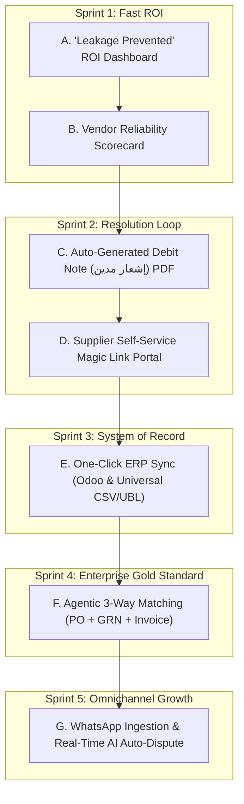

# Commercial Feature Expansion & Agentic AI Implementation Plan

## Goal Description
Transform the existing **Automated Invoice Reconciliation Agent** (currently at ~90% completion with Spring Boot 3.5, Java 21, MySQL 8.4, and Next.js 15) into an enterprise-ready, high-value commercial B2B platform. This plan details the phased execution order, architecture, testing strategy, and specific **Agentic AI** mechanisms for the remaining 7 high-impact features (excluding ETA e-invoicing for later).

---

## Agentic AI Architecture: The Autonomous Financial Auditor

In traditional automation, an application follows rigid script logic. In an **Agentic AI** architecture, the AI acts as an autonomous auditor endowed with **Perception**, **Reasoning**, **Tool Use**, and **Action**:

```
                       ┌──────────────────────────────────────────────┐
                       │           AGENTIC AUDITOR CORE               │
                       │     (Spring AI + Gemini 3.8 Flash)           │
                       └──────┬──────────────┬──────────────┬─────────┘
                              │              │              │
             ┌────────────────┘              │              └───────────────┐
             ▼                               ▼                              ▼
    [Perception Tools]               [Reasoning Engine]              [Action Tools]
┌───────────────────────────┐    ┌────────────────────────┐    ┌───────────────────────────┐
│ • Multimodal Document     │    │ • Semantic SKU mapping │    │ • Generate Debit Note PDF │
│   Ingestion (PDF/Image)   │    │ • Discrepancy analysis │    │ • Trigger ERP Vendor Bill │
│ • Arabic/English Text     │    │ • Behavioral vendor    │    │ • Dispatch WhatsApp/Email │
│   Stripping (PDFBox)      │    │   fraud detection      │    │ • Issue HMAC Magic Token  │
│ • GRN Handwritten Note    │    │ • Deterministic Math   │    │ • Auto-Update DB Status   │
│   Transcription           │    │   Invariance Guard     │    │                           │
└───────────────────────────┘    └────────────────────────┘    └───────────────────────────┘
```

### Core Agentic AI Tenets in this System:
1. **Deterministic Guardrails:** The Agentic AI is empowered to interpret messy, multilingual, real-world supplier documents and counter-arguments, but **must call deterministic Java tools** (`BigDecimal` arithmetic) to verify numbers. The agent *never* calculates totals itself.
2. **Tool-Calling Agent Loop:** In multi-step flows (like 3-Way Matching and WhatsApp conversations), the Agent autonomously decides which tool to invoke next based on intermediate findings.
3. **Contextual Memory & History:** The Agent leverages historical audit patterns (vendor dispute history, accepted tolerances, override history) to guide dispute drafting and risk scoring.

---

## Phased Implementation Roadmap

The features are ordered strategically to:
1. Build immediately on top of existing database entities and audit records.
2. Provide immediate visual and business ROI hooks for CFO demonstrations.
3. Progressively expand into interactive dispute resolution, enterprise ERP connectivity, 3-way warehouse matching, and real-time WhatsApp ingestion.



---

## Phase 1: Financial ROI Dashboard & Vendor Scorecard

### 1.1 "Leakage Prevented" Hero Metrics
- **Concept:** Transform the dashboard from a technical log into a compelling business justification dashboard that proves cost savings to the CFO.
- **Agentic AI Role:** 
  - An Agentic **"Executive Financial Analyst"** tool scans monthly audit logs and generates a concise, natural-language executive brief: *"In March, our AI auditor prevented 148,250 EGP in unauthorized charges across 42 invoices. 68% of leakage stemmed from unapproved freight markups by Vendor X."*
- **Backend Changes:**
  - Update `ReconciliationEngineService.java` to aggregate:
    - Total Invoiced Volume (EGP)
    - Total Direct Cash Leakage Blocked:
      $$\text{Leakage} = \sum (\text{actualValue} - \text{expectedValue}) \quad \text{for price mismatches and extra fees}$$
    - Total Quantity Shortage Value Prevented
    - Audit Accuracy Rate (%)
  - New Endpoint: `GET /api/analytics/roi-summary`
- **Frontend Changes:**
  - Modern hero KPI cards in `DashboardClient.tsx` featuring visual indicators, currency formatting in EGP, and an "Executive Brief" drawer.

### 1.2 Vendor Reliability Scorecard & Health Badges
- **Concept:** Track supplier compliance over time to identify chronic over-chargers and reliable partners.
- **Agentic AI Role:**
  - The AI reviews vendor historical variance trends, detects stealth inflation patterns (e.g., a vendor bumping prices 2% on alternate invoices), and assigns an automated **Risk Narrative** with recommendations for contract negotiations.
- **Backend Changes:**
  - New Endpoint: `GET /api/vendors/scorecard`
  - Metrics per vendor: Total Invoices, Clean Match Rate, Discrepancy Rate, Total Overcharge Attempted (EGP), Top Offending Categories (`PRICE_MISMATCH`, `EXTRA_FEE`).
  - Automated tier assignment: 🟢 *Certified Partner* (<3% variance), 🟡 *Audit Scrutiny* (3-15%), 🔴 *High-Risk Supplier* (>15%).
- **Frontend Changes:**
  - Dedicated `/vendors` page with searchable table, sortable risk scores, and expandable audit history.

---

## Phase 2: Actionable Dispute Settlement & Supplier Portal

### 2.1 Auto-Generated Debit Note (إشعار مدين / خصم) PDF Generator
- **Concept:** When an invoice contains variances, enterprise finance rarely cancels the entire shipment. Instead, they issue an official **Debit Note (إشعار مدين)** deducting the variance, pay the corrected balance, and legally close the transaction.
- **Agentic AI Role:**
  - AI synthesizes the exact legal and commercial justification for the deduction in bilingual Arabic and English, structuring it into standardized accounting clauses.
  - The backend invokes Apache PDFBox to render a formal, corporate-branded Debit Note with header, itemized deduction table, tax deduction breakdown, and manager signature line.
- **Backend Changes:**
  - New Service: `DebitNoteGeneratorService.java` using Apache PDFBox.
  - New Endpoint: `GET /api/invoices/{id}/debit-note` (returns printable PDF binary).
- **Frontend Changes:**
  - Add **"Download Debit Note (PDF)"** action button in `DisputeActionDrawer.tsx` and `SplitScreenViewer.tsx`.

### 2.2 Supplier Self-Service Dispute Portal (HMAC Magic Link)
- **Concept:** Eliminate chaotic email chains. When a dispute is dispatched, the vendor receives a tamper-proof HMAC magic link allowing them to view their invoice findings and resolve the dispute directly.
- **Agentic AI Role:**
  - When the vendor accesses the portal and enters an explanation or uploads an amended document, the **AI Negotiation Assistant** checks the vendor's explanation against the contract terms and proposes a resolution recommendation to the auditor.
- **Backend Changes:**
  - Extend `HmacTokenService.java` to issue time-bounded `VENDOR_DISPUTE_PORTAL` tokens (e.g., 7 days validity).
  - New Public Endpoints:
    - `GET /api/portal/dispute?token=...` -> Returns restricted view of invoice discrepancies.
    - `POST /api/portal/dispute/accept?token=...` -> Vendor formally accepts deduction; triggers auto-issuance of Debit Note.
    - `POST /api/portal/dispute/upload-amended?token=...` -> Ingests replacement invoice and automatically triggers re-reconciliation!
- **Frontend Changes:**
  - Clean, secure supplier-facing page: `frontend/src/app/portal/dispute/page.tsx`.

---

## Phase 3: Enterprise ERP & Accounting Sync

### 3.1 One-Click ERP Sync (Odoo API & Universal UBL/CSV)
- **Concept:** Once an invoice is marked `APPROVED` or `APPROVED_BY_OVERRIDE`, push the clean, validated transaction directly into the client's accounting software to eliminate manual data entry.
- **Agentic AI Role:**
  - The AI acts as an **ERP Schema Mapper**: maps custom vendor descriptions and line-item categories into the customer's specific ERP General Ledger (GL) account codes and tax categories.
- **Backend Architecture:**
  - **Universal Export:** `GET /api/invoices/export?format=csv|xlsx|ubl-xml` (standard format ready for SAP, Oracle, QuickBooks).
  - **Odoo Integration Service:** `OdooSyncService.java` connecting via Odoo's JSON-RPC API (`/jsonrpc` on `account.move` model) to create draft Vendor Bills with lines, taxes, and attached PDF.
  - New Endpoint: `POST /api/invoices/{id}/sync-erp`
- **Frontend Changes:**
  - ERP Sync status badge on the dashboard (`SYNCED_TO_ERP`, `PENDING_SYNC`).
  - "Sync to ERP" button with live status feedback.

---

## Phase 4: Agentic 3-Way Matching Engine (PO + GRN + Invoice)

### 4.1 Enterprise 3-Way Reconciliation
- **Concept:** Upgrade from 2-way match (PO vs Invoice) to true enterprise **3-Way Match**:
  $$\text{Invoice (Billed)} \longleftrightarrow \text{Purchase Order (Ordered)} \longleftrightarrow \text{Goods Receipt Note (Delivered)}$$
  Catches shipments where the supplier billed for 100 units because 100 were ordered, but warehouse loading docks only received 80 units.
- **Agentic AI Role:**
  - **Multimodal GRN Perception:** Warehouse delivery receipts and storekeeper vouchers (إذن استلام مخزني / بوليصة شحن) are often hand-written, stamped, or wrinkled carbon paper. The Agentic Multimodal Vision model extracts received quantities, damaged goods notes, and storekeeper signatures.
  - **Autonomous Cross-Auditing:** The AI cross-correlates line items across all three documents and isolates the exact root cause:
    - *Scenario A:* Vendor overbilled (Billed > Delivered = Ordered).
    - *Scenario B:* Short delivery without credit (Delivered < Ordered = Billed).
- **Backend Changes:**
  - New Entity: `GoodsReceiptNote` and `GoodsReceiptNoteItem`.
  - Update `ReconciliationEngineService.java` with 3-way verification rules.
  - New Issue Types: `QUANTITY_EXCEEDS_DELIVERY`, `UNCONFIRMED_DELIVERY`.
- **Frontend Changes:**
  - Three-panel or toggle viewer in `SplitScreenViewer.tsx` displaying PO, Invoice, and Delivery Receipt side-by-side.

---

## Phase 5: Agentic WhatsApp Ingestion & Real-Time Auto-Dispute

### 5.1 Omnichannel WhatsApp Ingestion (Egypt & MENA Reality)
- **Concept:** Allow field managers, drivers, and local suppliers to submit invoices simply by sending a photo or PDF over WhatsApp.
- **Agentic AI Role (Autonomous Conversational Auditor):**
  - **Autonomous Ingestion:** Webhook receives incoming media, sends it to `InvoiceExtractionService`, and runs Java reconciliation.
  - **Instant Clean Approval:** If clean, the Agent immediately replies on WhatsApp:
    *"✅ تم تدقيق واعتماد فاتورة رقم #INV-492 بمبلغ 12,450 ج.م بنجاح وتم إرسالها لقسم الحسابات للصرف."*
  - **Interactive Conversational Dispute:** If discrepancies exist, the Agent replies with the formatted Arabic findings and provides interactive buttons:
    *"⚠️ رصد النظام زيادة في سعر طن الأسمنت بمقدار 150 ج.م عن أمر التوريد PO-2026-004. هل ترغب في إرسال إشعار خصم بفارق المبلغ (3,000 ج.م)؟"*
    When the vendor replies "موافق" (Agreed), the Agent accepts the adjustment, issues the Debit Note, and updates the invoice record!
- **Backend Architecture:**
  - New Controller: `WhatsAppWebhookController.java` (`POST /api/webhooks/whatsapp`).
  - Integration with **Meta WhatsApp Cloud API** (or Twilio WhatsApp sandbox for local dev).
  - Background conversational state cache.

---

## Implementation Order & Testing Strategy

```
┌──────────────────────────────────────────────────────────────────────────────┐
│                        STEP-BY-STEP EXECUTION ORDER                          │
├───────┬──────────────────────────────────────────┬───────────────────────────┤
│ Step  │ Feature Module                           │ Verification Test Suite   │
├───────┼──────────────────────────────────────────┼───────────────────────────┤
│ 1     │ "Leakage Prevented" Hero KPIs & API      │ FinancialAnalyticsTest    │
│ 2     │ Vendor Reliability Scorecard & API       │ VendorScorecardTest       │
│ 3     │ Debit Note PDF Generator (PDFBox)        │ DebitNoteGenerationTest   │
│ 4     │ Supplier Dispute Portal (HMAC Links)     │ SupplierPortalTest        │
│ 5     │ One-Click ERP Export & Odoo Sync Hook    │ ErpSyncServiceTest        │
│ 6     │ 3-Way Matching Engine (PO + GRN)         │ ThreeWayMatchingTest      │
│ 7     │ WhatsApp Webhook Ingestion & AI Loop     │ WhatsAppWebhookTest       │
└───────┴──────────────────────────────────────────┴───────────────────────────┘
```

---

## User Review Required

> [!IMPORTANT]
> **Key Architectural Decisions for Implementation:**
> 1. **Phase 1 Priority:** Steps 1 and 2 require **zero new external dependencies** and can be built immediately using our existing MySQL data and Spring Boot controllers, giving instant visual value on the frontend.
> 2. **WhatsApp Provider:** For local testing of Phase 5, we can implement the standard Meta WhatsApp Cloud API webhook format with a local simulation harness, ensuring seamless production deployment when credentials are provided.
> 3. **ERP Provider:** We will provide both a universal download (CSV/Excel) and an Odoo 16/17 compatible JSON-RPC client adapter.

Do you approve proceeding with **Phase 1: "Leakage Prevented" ROI Dashboard & Vendor Reliability Scorecard** as the initial execution target?
