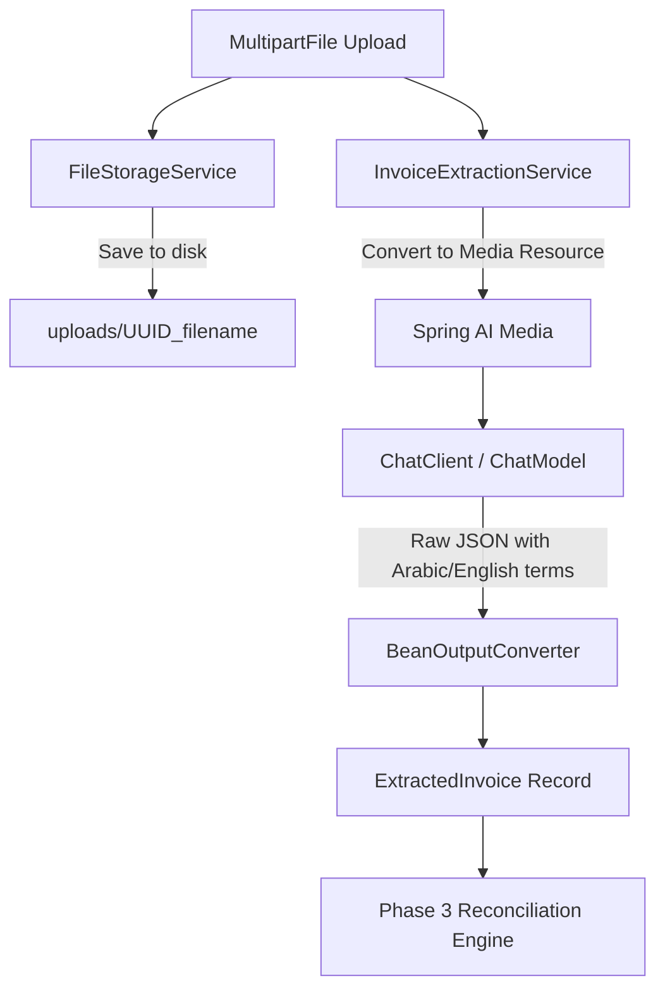

# Implementation Plan: Phase 2 - Multimodal Extraction Service & Structured DTOs

## Goal Description
Implement the multimodal data extraction layer and supporting data structures for the Automated Invoice Reconciliation system as defined in [PPROJECT_SPEC.md](file:///Users/mohamed.abdelfatah/Mohamed-Ramadan/Automated-Invoice-Reconciliation/PPROJECT_SPEC.md) and the user requirements:
1. Define immutable structured output DTOs using Java Records and `BigDecimal`.
2. Implement local file storage service (`FileStorageService`) for saving uploaded invoice files (PDF/PNG/JPEG) into `../uploads` with UUID-based names and loading them as Spring `Resource`.
3. Implement `InvoiceExtractionService` using Spring AI's `ChatClient.Builder`, `Media`, and `BeanOutputConverter` targeting `gpt-4o` with temperature `0.0` and bilingual extraction invariants (Arabic/English, zero math in LLM).
4. Verify deserialization with unit tests (`InvoiceExtractionServiceTest`) mocking `ChatModel` using an Arabic receipt payload.

---

## User Review Required

> [!IMPORTANT]
> **Strict Non-Negotiable Separation:** In accordance with project architecture, the LLM will **never perform calculations** (no summing line totals or recalculating taxes). Mathematical verification is reserved for Phase 3 (pure Java reconciliation engine). All monetary and quantity figures are extracted strictly as printed using `BigDecimal`.

> [!NOTE]
> Environment JDK configuration: The repository specifies Java 21. `mvnw` will include a helper check for macOS `java_home -v 21` so `./mvnw test -Dtest=InvoiceExtractionServiceTest` succeeds without requiring manual environment exports.

---

## Proposed Changes



### Component 1: Structured Output DTOs (`com.agent.reconciliation.domain.dto`)

Define immutable records using `BigDecimal` for all numeric values:

#### [NEW] [ExtractedLineItem.java](file:///Users/mohamed.abdelfatah/Mohamed-Ramadan/Automated-Invoice-Reconciliation/src/main/java/com/agent/reconciliation/domain/dto/ExtractedLineItem.java)
- Fields:
  * `String vendorItemDescription`
  * `BigDecimal quantity`
  * `BigDecimal unitPrice`
  * `BigDecimal lineTotal`
  * `String suggestedSku`

#### [NEW] [ExtractedInvoice.java](file:///Users/mohamed.abdelfatah/Mohamed-Ramadan/Automated-Invoice-Reconciliation/src/main/java/com/agent/reconciliation/domain/dto/ExtractedInvoice.java)
- Fields:
  * `String invoiceNumber`
  * `String poReference`
  * `String vendorName`
  * `List<ExtractedLineItem> items`
  * `BigDecimal extraFees`
  * `BigDecimal grandTotal`

#### [NEW] [ReconciliationSummaryResponse.java](file:///Users/mohamed.abdelfatah/Mohamed-Ramadan/Automated-Invoice-Reconciliation/src/main/java/com/agent/reconciliation/domain/dto/ReconciliationSummaryResponse.java)
- Fields:
  * `Long invoiceId`
  * `String invoiceNumber`
  * `String poReference`
  * `String vendorName`
  * `String reconciliationStatus`
  * `BigDecimal invoicedTotal`
  * `BigDecimal expectedTotal`
  * `int discrepancyCount`
  * `List<AuditDetailResponse> audits`
  * `String disputeDraft`
  * `String fileDownloadUri`

#### [NEW] [AuditDetailResponse.java](file:///Users/mohamed.abdelfatah/Mohamed-Ramadan/Automated-Invoice-Reconciliation/src/main/java/com/agent/reconciliation/domain/dto/AuditDetailResponse.java)
- Fields:
  * `Long id`
  * `String issueType`
  * `String skuCode`
  * `String itemDescription`
  * `BigDecimal expectedValue`
  * `BigDecimal actualValue`
  * `String explanation`

---

### Component 2: Local File Storage Service (`com.agent.reconciliation.service`)

#### [NEW] [FileStorageService.java](file:///Users/mohamed.abdelfatah/Mohamed-Ramadan/Automated-Invoice-Reconciliation/src/main/java/com/agent/reconciliation/service/FileStorageService.java)
- Configurable upload directory (`../uploads`), created on startup if missing.
- Method `String storeFile(MultipartFile file)`:
  - Validates file presence and filename.
  - Sanitizes filename and prepends UUID (`<uuid>_<originalFilename>`).
  - Writes bytes safely to `../uploads` directory.
  - Returns normalized local file path.
- Method `Resource loadFileAsResource(String filePath)`:
  - Resolves path and returns Spring `Resource` (`UrlResource` / `FileSystemResource`).
  - Throws runtime exception if file not found or unreadable.

---

### Component 3: Spring AI Extraction Service (`com.agent.reconciliation.service`)

#### [NEW] [InvoiceExtractionService.java](file:///Users/mohamed.abdelfatah/Mohamed-Ramadan/Automated-Invoice-Reconciliation/src/main/java/com/agent/reconciliation/service/InvoiceExtractionService.java)
- Injects `ChatClient.Builder`.
- Initializes `BeanOutputConverter<ExtractedInvoice>`.
- Method `ExtractedInvoice extractInvoice(MultipartFile file)`:
  - Validates file content and detects MIME type (`application/pdf`, `image/png`, `image/jpeg`).
  - Wraps file into Spring AI `Media(MimeType, Resource)`.
  - Configures `OpenAiChatOptions.builder().model("gpt-4o").temperature(0.0).build()`.
  - System prompt enforcing invariants:
    1. Zero math: Extract numbers strictly as printed on the document. Do not recalculate totals or balances.
    2. Bilingual support: Egyptian Arabic supply chain terms ("طماطم", "بصل", "مشال", "توصيل", "ضريبة", "أمر توريد").
    3. Numeral normalization: Convert Arabic-Indic numerals (٠-٩) to standard decimal digits (0-9).
    4. SKU mapping: Canonical SKU suggestions for known commodities (e.g., `'SKU-TOMATO-RED'`), or `null` if unrecognized.
    5. Extra fees: Map delivery/porterage ('مشال' / 'توصيل') to `extraFees`.
  - Executes ChatClient call and deserializes output into `ExtractedInvoice`.

---

### Component 4: Environment & Build Enhancements

#### [MODIFY] [mvnw](file:///Users/mohamed.abdelfatah/Mohamed-Ramadan/Automated-Invoice-Reconciliation/mvnw)
- Add detection for macOS `/usr/libexec/java_home -v 21` when Java 21 is available but system default is Java 17, ensuring `./mvnw test` commands work out-of-the-box.

---

### Component 5: Unit Tests

#### [NEW] [InvoiceExtractionServiceTest.java](file:///Users/mohamed.abdelfatah/Mohamed-Ramadan/Automated-Invoice-Reconciliation/src/test/java/com/agent/reconciliation/service/InvoiceExtractionServiceTest.java)
- Mock `ChatModel` using Mockito.
- Pass mock into `ChatClient.builder(mockChatModel)`.
- Provide authentic Arabic invoice JSON containing:
  - Invoice: "INV-2026-099", PO: "PO-2026-001", Vendor: "شركة الأهرام للتوريدات الغذائية"
  - Line items: "طماطم بلدي طازجة فاخرة" (100.00 qty, 15.50 unitPrice, 1550.00 lineTotal, 'SKU-TOMATO-RED'), "بصل أحمر درجة أولى" (50.00 qty, 12.00 unitPrice, 600.00 lineTotal, 'SKU-ONION-YELLOW')
  - Extra fees: 150.00 (مشال وتوصيل)
  - Grand total: 2300.00
- Verify:
  - Parses into `ExtractedInvoice` with zero conversion errors.
  - Zero null fields across all fields.
  - Correct `BigDecimal` precision and scale.

#### [NEW] [FileStorageServiceTest.java](file:///Users/mohamed.abdelfatah/Mohamed-Ramadan/Automated-Invoice-Reconciliation/src/test/java/com/agent/reconciliation/service/FileStorageServiceTest.java)
- Test `storeFile` with a mock file; verify file exists on disk and has UUID prefix.
- Test `loadFileAsResource`; verify readable Resource.
- Test missing file handling throws exception.

---

## Verification Plan

### Automated Tests
```bash
./mvnw test -Dtest=InvoiceExtractionServiceTest
./mvnw test -Dtest=FileStorageServiceTest
./mvnw test
```

### Success Criteria
1. `InvoiceExtractionServiceTest` executes and passes with 0 failures and 0 errors.
2. Deserialization of bilingual Arabic/English invoice JSON into `ExtractedInvoice` succeeds with all fields populated.
3. Clean compilation with Java 21.
