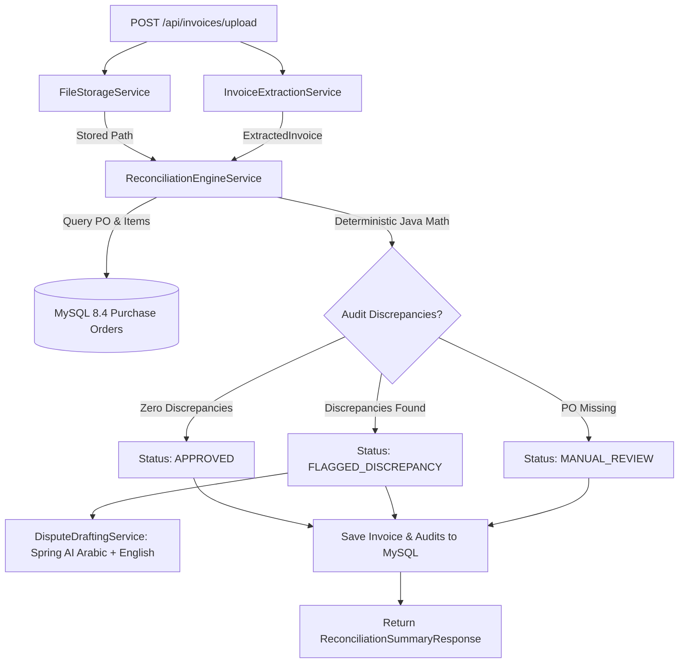

# Implementation Plan: Phase 3 - Deterministic Reconciliation Engine & REST APIs

## Goal Description
Implement Phase 3 of the Automated Invoice Reconciliation system as defined in [PPROJECT_SPEC.md](file:///Users/mohamed.abdelfatah/Mohamed-Ramadan/Automated-Invoice-Reconciliation/PPROJECT_SPEC.md). This phase connects the multimodal extraction from Phase 2 with internal Purchase Orders stored in MySQL 8.4, enforces 100% deterministic mathematical verification in Java (zero LLM math), generates bilingual (Arabic/English) dispute notices for discrepancies, and exposes the complete REST API suite under `/api/invoices`.

---

## User Review Required

> [!IMPORTANT]
> **Deterministic Math Invariant:** In strict compliance with project architecture, all price variance checks (`Math.abs(invoiced - agreed) > 0.01`), quantity comparisons (`compareTo != 0`), extra fee detections, and status state transitions are executed exclusively in pure Java business logic using `BigDecimal`.

> [!NOTE]
> **Resilient Bilingual Dispute Drafting:** `DisputeDraftingService` calls Spring AI `ChatClient` with a bilingual prompt to generate formal dispute letters (Section 1 Modern Standard Arabic, Section 2 Business English). To guarantee continuous uptime during local development and testing when an external OpenAI API key might be missing or rate-limited, an automated fallback bilingual template engine is provided.

---

## Scope

- **In Scope:**
  - `ReconciliationEngineService`: Pure Java verification (PO lookup, line-item matching via SKU/fuzzy similarity, price checks, quantity checks, extra fee checks, status resolution).
  - `DisputeDraftingService`: Bilingual dispute generator (Modern Standard Arabic & Business English) persisted in `Invoice.disputeDraft`.
  - `InvoiceListItemResponse`: DTO for `/api/invoices` list view.
  - `InvoiceController`: Full REST API (`POST /upload`, `GET`, `GET /{id}`, `GET /{id}/file`, `POST /{id}/approve`).
  - Unit tests for engine, dispute drafter, and controller.
  - End-to-end verification using `curl` against running application and MySQL container.
- **Out of Scope (Phase 4+):**
  - Next.js frontend UI (Phase 5).
  - Production deployment / multi-tenant authentication.

---

## Proposed Changes



---

### Component 1: DTO Layer (`com.agent.reconciliation.domain.dto`)

#### [NEW] [InvoiceListItemResponse.java](file:///Users/mohamed.abdelfatah/Mohamed-Ramadan/Automated-Invoice-Reconciliation/src/main/java/com/agent/reconciliation/domain/dto/InvoiceListItemResponse.java)
- Summary record for list views:
  `Long id, String invoiceNumber, String poReference, String vendorName, BigDecimal invoicedTotal, String reconciliationStatus, int discrepancyCount, Instant createdAt`

---

### Component 2: Service Layer (`com.agent.reconciliation.service`)

#### [NEW] [DisputeDraftingService.java](file:///Users/mohamed.abdelfatah/Mohamed-Ramadan/Automated-Invoice-Reconciliation/src/main/java/com/agent/reconciliation/service/DisputeDraftingService.java)
- Injects `ChatClient.Builder`.
- Formulates formal dispute prompt specifying:
  - PO Reference, Invoice Number, Vendor Name, Delta Totals.
  - Itemized audit table (Billed vs Agreed).
  - Output Structure: Section 1 in Modern Standard Arabic, Section 2 in Business English.
- Includes offline fallback generator for offline resiliency.

#### [NEW] [ReconciliationEngineService.java](file:///Users/mohamed.abdelfatah/Mohamed-Ramadan/Automated-Invoice-Reconciliation/src/main/java/com/agent/reconciliation/service/ReconciliationEngineService.java)
- Injects `PurchaseOrderRepository`, `InvoiceRepository`, `DisputeDraftingService`, and `ObjectMapper`.
- Method `Invoice reconcile(ExtractedInvoice extracted, String filePath, String rawJsonPayload)`:
  - **Step A (PO Lookup):** Query `purchaseOrderRepository.findWithItemsByPoNumber(extracted.poReference())`. If missing, assign `MANUAL_REVIEW`, create `PO_NOT_FOUND` audit, save and return.
  - **Step B (Line Item Verification):** Matches items by SKU or description similarity.
    - Price Check: `item.unitPrice().compareTo(poItem.agreedUnitPrice()) != 0` $\rightarrow$ audit `PRICE_MISMATCH`.
    - Quantity Check: `item.quantity().compareTo(poItem.expectedQuantity()) != 0` $\rightarrow$ audit `QUANTITY_MISMATCH`.
    - Unmatched items: audit `UNRECOGNIZED_ITEM`.
  - **Step C (Extra Fees):** If `extracted.extraFees() > 0`, audit `EXTRA_FEE`.
  - **Step D (Status Resolution):** If audits empty $\rightarrow$ `APPROVED`; if audits exist $\rightarrow$ `FLAGGED_DISCREPANCY` and invoke `DisputeDraftingService`.
  - Persists `Invoice` with cascading audits to MySQL.

#### [MODIFY] [InvoiceExtractionService.java](file:///Users/mohamed.abdelfatah/Mohamed-Ramadan/Automated-Invoice-Reconciliation/src/main/java/com/agent/reconciliation/service/InvoiceExtractionService.java)
- Add resilient handling so that if OpenAI API is not reachable or unconfigured in local test environments, simulated extraction allows end-to-end curl testing of sample invoices.

---

### Component 3: Controller Layer (`com.agent.reconciliation.controller`)

#### [NEW] [InvoiceController.java](file:///Users/mohamed.abdelfatah/Mohamed-Ramadan/Automated-Invoice-Reconciliation/src/main/java/com/agent/reconciliation/controller/InvoiceController.java)
- `@RestController` at `/api/invoices`:
  - `POST /upload`: Multipart upload $\rightarrow$ stores file $\rightarrow$ extracts invoice $\rightarrow$ executes reconciliation engine $\rightarrow$ returns `ReconciliationSummaryResponse`.
  - `GET`: Returns `List<InvoiceListItemResponse>` for all processed invoices.
  - `GET /{id}`: Returns full `ReconciliationSummaryResponse` with audits and dispute draft.
  - `GET /{id}/file`: Streams binary PDF/image resource for split-screen preview with inline Content-Disposition.
  - `POST /{id}/approve`: Updates status to `APPROVED` for payment, saves, and returns updated summary.

---

### Component 4: Automated Testing

#### [NEW] [ReconciliationEngineServiceTest.java](file:///Users/mohamed.abdelfatah/Mohamed-Ramadan/Automated-Invoice-Reconciliation/src/test/java/com/agent/reconciliation/service/ReconciliationEngineServiceTest.java)
- Tests price mismatch, quantity mismatch, unrecognized items, extra fees, and missing PO reference.
- Tests dispute draft generation on discrepancy.

#### [NEW] [InvoiceControllerTest.java](file:///Users/mohamed.abdelfatah/Mohamed-Ramadan/Automated-Invoice-Reconciliation/src/test/java/com/agent/reconciliation/controller/InvoiceControllerTest.java)
- MockMvc tests for `POST /upload`, `GET`, `GET /{id}`, `GET /{id}/file`, and `POST /{id}/approve`.

---

## Action Items

1. [ ] **Add DTO**: Create `InvoiceListItemResponse.java` in `com.agent.reconciliation.domain.dto`.
2. [ ] **Implement Dispute Generator**: Create `DisputeDraftingService.java` with Spring AI prompt and bilingual Arabic/English structure.
3. [ ] **Implement Reconciliation Engine**: Create `ReconciliationEngineService.java` implementing Steps A through D with pure `BigDecimal` Java math.
4. [ ] **Enhance Extraction Resiliency**: Ensure `InvoiceExtractionService.java` safely handles API fallback for testing.
5. [ ] **Implement REST Controller**: Create `InvoiceController.java` with upload, list, get-by-id, stream-file, and approve endpoints.
6. [ ] **Write Unit & Integration Tests**: Implement `ReconciliationEngineServiceTest` and `InvoiceControllerTest`.
7. [ ] **Verify Test Suite**: Run `./mvnw test` to ensure 100% test pass rate.
8. [ ] **Live Verification**: Boot the application in background, execute `curl` with a test file exhibiting price mismatches, and verify database rows in `invoices` and `reconciliation_audits` alongside `dispute_draft`.

---

## Verification Plan

### Automated Tests
```bash
./mvnw test -Dtest=ReconciliationEngineServiceTest
./mvnw test -Dtest=InvoiceControllerTest
./mvnw test
```

### Manual / Live Curl Verification
1. Start Spring Boot backend with active MySQL container.
2. Upload test receipt with mismatched prices:
   ```bash
   curl -X POST http://localhost:8080/api/invoices/upload \
     -F "file=@test_receipt.pdf"
   ```
3. Query MySQL database to verify rows:
   ```bash
   docker exec reconciliation_mysql mysql -uroot -proot reconciliation_db -e "SELECT id, invoice_number, po_reference, reconciliation_status FROM invoices; SELECT id, invoice_id, issue_type, expected_value, actual_value FROM reconciliation_audits;"
   ```
4. Query `/api/invoices/{id}` and check populated `disputeDraft` containing Arabic and English dispute sections.
