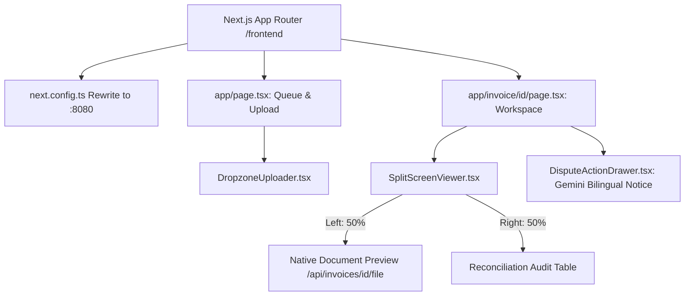

# Implementation Plan: Phase 4 - Next.js 15 Review Interface (`/frontend`)

## Goal Description
Implement the modern Next.js 15 frontend interface in `/frontend` for the Automated Invoice Reconciliation system as defined in [PPROJECT_SPEC.md](file:///Users/mohamed.abdelfatah/Mohamed-Ramadan/Automated-Invoice-Reconciliation/PPROJECT_SPEC.md). This phase provides financial auditors with an intuitive, high-density split-screen review dashboard:
1. Native document preview (PDF/images) on the left panel with zoom and view controls.
2. Structured reconciliation table on the right panel highlighting price hikes, quantity variances, and extra fees.
3. Collapsible bilingual dispute drawer (Arabic & English) with one-click copy and payment approval actions.
4. Invoice queue dashboard with upload dropzone and live status tracking.

---

## User Review Required

> [!IMPORTANT]
> **50/50 Split-Screen UX:** The review workspace (`/invoice/[id]`) uses a responsive desktop-first 50/50 split layout: the left viewport embeds the original raw PDF/image via `/api/invoices/{id}/file`, while the right viewport renders the structured audit findings, variance deltas, and dispute draft.

> [!NOTE]
> **API Proxying via Next.js Rewrites:** In `next.config.ts`, `/api/:path*` is proxied to `http://localhost:8080/api/:path*`, allowing seamless communication without CORS issues.

---

## Scope

- **In Scope:**
  - Next.js 15 (App Router, React 19, TypeScript, Tailwind CSS, Lucide React).
  - API proxy rewrite in `next.config.ts`.
  - TypeScript interfaces mirroring backend records in `lib/types.ts`.
  - `DropzoneUploader.tsx`: Drag-and-drop file upload with animated states (PDF/PNG/JPG).
  - `SplitScreenViewer.tsx`: Master 50/50 container with zoomable PDF preview on the left and reconciliation table on the right.
  - `DisputeActionDrawer.tsx`: Bilingual dispute display (Arabic & English) with copy-to-clipboard and "Approve & Release Payment" action.
  - `app/page.tsx`: Queue view with upload dropzone and invoice history table.
  - `app/invoice/[id]/page.tsx`: Full split-screen auditor workspace.
  - Verification via browser testing on `http://localhost:3000`.

- **Out of Scope:**
  - Multi-tenant user login (covered in future production hardening).

---

## Proposed Changes



### Component 1: Project Scaffolding & Setup (`frontend/`)

- Scaffold Next.js 15 using `create-next-app` with TypeScript, Tailwind CSS, App Router, and ESLint.
- Install `lucide-react`, `clsx`, `tailwind-merge`.
- Configure `next.config.ts`:
  ```typescript
  async rewrites() {
    return [
      {
        source: '/api/:path*',
        destination: 'http://localhost:8080/api/:path*',
      },
    ];
  }
  ```

### Component 2: Types & API Client (`frontend/src/lib/`)

#### [NEW] [types.ts](file:///Users/mohamed.abdelfatah/Mohamed-Ramadan/Automated-Invoice-Reconciliation/frontend/src/lib/types.ts)
- `AuditDetailResponse`: `id, issueType, skuCode, itemDescription, expectedValue, actualValue, explanation`
- `ReconciliationSummaryResponse`: `invoiceId, invoiceNumber, poReference, vendorName, reconciliationStatus, invoicedTotal, expectedTotal, discrepancyCount, audits, disputeDraft, fileDownloadUri`
- `InvoiceListItemResponse`: `id, invoiceNumber, poReference, vendorName, invoicedTotal, reconciliationStatus, discrepancyCount, createdAt`

---

### Component 3: Core UI Components (`frontend/src/components/`)

#### [NEW] [DropzoneUploader.tsx](file:///Users/mohamed.abdelfatah/Mohamed-Ramadan/Automated-Invoice-Reconciliation/frontend/src/components/DropzoneUploader.tsx)
- Drag-and-drop zone supporting `.pdf`, `.png`, `.jpg`, `.jpeg`.
- Visual states: idle, drag-over, uploading with animated spinner/progress, and error handling.
- On success, triggers router push to `/invoice/{newInvoiceId}` or refreshes queue.

#### [NEW] [SplitScreenViewer.tsx](file:///Users/mohamed.abdelfatah/Mohamed-Ramadan/Automated-Invoice-Reconciliation/frontend/src/components/SplitScreenViewer.tsx)
- Master 50/50 container:
  - **Left Viewport (Document Preview):**
    - Embeds native PDF preview with fallback (`<iframe src="/api/invoices/{id}/file" />` / `<object>`).
    - Floating action bar: Zoom in, Zoom out, Fit to screen, Open in new tab, Download.
  - **Right Viewport (Reconciliation Table):**
    - Metadata Header: Invoice #, PO Reference, Vendor Name, Total Billed, Expected Total, Status Pill (`APPROVED` green, `FLAGGED_DISCREPANCY` red, `MANUAL_REVIEW` amber).
    - Variance Delta Highlight: Displays net financial discrepancy (+/- EGP).
    - Itemized Table: Description, Billed Unit Price vs PO Agreed Price, Billed Qty vs Ordered Qty, Line Total.
    - Soft rose highlighting (`bg-rose-50/80 text-rose-800 border-rose-200`) for price/quantity mismatches.
    - Discrepancy Breakdown Cards: Clear badges with human-readable explanations.

#### [NEW] [DisputeActionDrawer.tsx](file:///Users/mohamed.abdelfatah/Mohamed-Ramadan/Automated-Invoice-Reconciliation/frontend/src/components/DisputeActionDrawer.tsx)
- Collapsible drawer for Gemini-generated bilingual dispute letter:
  - Tab selector / side-by-side view for Arabic (`القسم الأول: إشعار الاعتراض المالي`) and English (`Section 2: Formal Financial Dispute Notice`).
  - "Copy Dispute Notice" button with instant visual feedback ("Copied to clipboard!").
  - "Approve & Release Payment" button sending `POST /api/invoices/{id}/approve` with live status update.

---

### Component 4: Application Routes (`frontend/src/app/`)

#### [NEW] [page.tsx](file:///Users/mohamed.abdelfatah/Mohamed-Ramadan/Automated-Invoice-Reconciliation/frontend/src/app/page.tsx)
- Financial Audit Operations Queue:
  - Metric summary cards (Total Processed, Discrepancies Flagged, Approved, Total EGP Audited).
  - Prominent upload dropzone card.
  - Live table of processed invoices with status pills, discrepancy counts, and "Open Workspace $\rightarrow$" links.

#### [NEW] [invoice/[id]/page.tsx](file:///Users/mohamed.abdelfatah/Mohamed-Ramadan/Automated-Invoice-Reconciliation/frontend/src/app/invoice/[id]/page.tsx)
- Deep-dive reconciliation workspace embedding `SplitScreenViewer` and `DisputeActionDrawer`.
- Navigation breadcrumb back to the invoices queue.

---

## Action Items

1. [ ] **Scaffold App**: Run `create-next-app` in `/frontend` with TypeScript and Tailwind CSS.
2. [ ] **Install Dependencies**: Install `lucide-react`, `clsx`, `tailwind-merge`.
3. [ ] **Configure Rewrites**: Setup `/api/:path*` proxy in `frontend/next.config.ts`.
4. [ ] **Define Types**: Create `frontend/src/lib/types.ts`.
5. [ ] **Build Dropzone**: Implement `DropzoneUploader.tsx`.
6. [ ] **Build Split Viewer**: Implement `SplitScreenViewer.tsx` (PDF preview + audit table).
7. [ ] **Build Dispute Drawer**: Implement `DisputeActionDrawer.tsx` (bilingual draft + approve).
8. [ ] **Implement Dashboard**: Create `app/page.tsx` with metrics and queue table.
9. [ ] **Implement Workspace**: Create `app/invoice/[id]/page.tsx`.
10. [ ] **Verify in Browser**: Boot frontend (`npm run dev`), open `http://localhost:3000`, test file upload and split-screen review.

---

## Verification Plan

### Automated / Browser Verification
1. Boot Next.js dev server on port 3000 with backend active on port 8080.
2. Navigate to `http://localhost:3000`.
3. Verify that invoice `INV-3860` (created in Phase 3) appears in the dashboard queue with status `FLAGGED_DISCREPANCY` and 2 discrepancies.
4. Click on `INV-3860` to enter the split-screen workspace:
   - Left side: PDF document preview streams from `/api/invoices/1/file`.
   - Right side: Reconciliation table with red-highlighted price mismatch (+5.00 EGP) and unapproved surcharge (+150.00 EGP).
   - Dispute drawer: Displays the Gemini Arabic and English dispute notice.
5. Upload `sample_invoice_mismatch.pdf` from the dropzone on `http://localhost:3000` and confirm smooth redirection.
