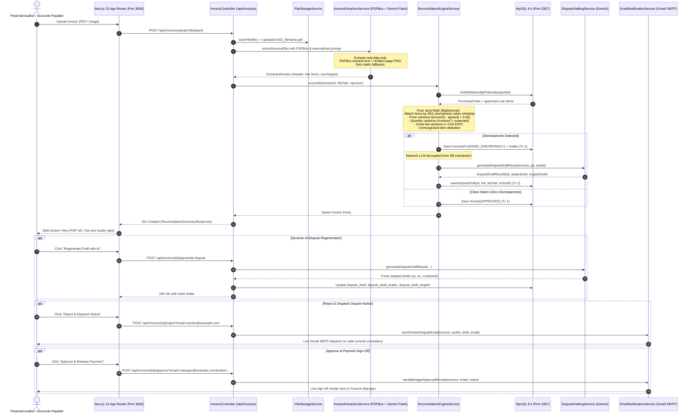

# Automated Invoice Reconciliation Agent: Comprehensive Project Walkthrough

## Executive Summary

The **Automated Invoice Reconciliation Agent** is an enterprise-grade financial audit system designed for multi-industry, bilingual (Arabic & English) supply chain operations. It automates the end-to-end reconciliation lifecycle:
1. **Dynamic Real-Document Extraction (No Static Fallbacks):** Multimodal document ingestion (PDF, PNG, JPEG) of supplier invoices using Google Gemini (`gemini-3.8-flash`) via Spring AI and Apache PDFBox (extracting raw text and rendering pages to PNG for vision models).
2. **100% Deterministic Mathematical Verification in Java:** Pure Java `BigDecimal` arithmetic (zero math delegation to LLMs) against MySQL 8.4 Purchase Orders with 0.00 EGP tolerance.
3. **Generic SKU & Product Retrieval from Database:** Matches invoice items to PO items and enterprise catalogs by canonical `skuCode` and generic normalized token similarity (applicable to electronics, retail, construction, pharmaceuticals, commodities, etc.).
4. **Itemized Discrepancy Findings:** Unit price hikes (`PRICE_MISMATCH`), billed quantity variances (`QUANTITY_MISMATCH`), unapproved delivery/porterage fees (`EXTRA_FEE`), unrecognized products (`UNRECOGNIZED_ITEM`), and missing PO records (`PO_NOT_FOUND`).
5. **Strict Dispute Language Isolation & Parity:** Dual-language dispute draft generation isolating Arabic and English texts into dedicated database columns (`dispute_draft_arabic` and `dispute_draft_english`), with machine-readable delimiters ensuring 100% parity between Bilingual and single-language tabs.
6. **High-Density Split-Screen Auditor Workspace:** Next.js 15 App Router interface with fit-width PDF streaming (`#view=FitH`), two-line separated bilingual findings (without badge clutter), and dynamic AI dispute regeneration.
7. **Commercial Email Engine:** Decoupled presentation with zero HTML/CSS in Java code, modular externalized templates in `src/main/resources/mail/`, live Gmail SMTP dispatch, and one-click manager payment override links.

---

## System Architecture & End-to-End Flow



---

## Detailed Milestone Walkthroughs

### Phase 1: Database Persistence & Domain Schema
- **Database Engine:** MySQL 8.4 LTS running in Docker container (`reconciliation_mysql`) exposed on port `3307`.
- **Domain Entities:**
  - [PurchaseOrder.java](file:///Users/mohamed.abdelfatah/Mohamed-Ramadan/Automated-Invoice-Reconciliation/src/main/java/com/agent/reconciliation/domain/entity/PurchaseOrder.java): Purchase orders with vendor metadata, status, expected totals, and line items.
  - [PurchaseOrderItem.java](file:///Users/mohamed.abdelfatah/Mohamed-Ramadan/Automated-Invoice-Reconciliation/src/main/java/com/agent/reconciliation/domain/entity/PurchaseOrderItem.java): Product lines specifying canonical `skuCode`, descriptions, `expectedQuantity`, and `agreedUnitPrice`.
  - [Invoice.java](file:///Users/mohamed.abdelfatah/Mohamed-Ramadan/Automated-Invoice-Reconciliation/src/main/java/com/agent/reconciliation/domain/entity/Invoice.java): Invoices holding totals, file paths, statuses, `disputeDraft`, `disputeDraftArabic`, and `disputeDraftEnglish`.
  - [ReconciliationAudit.java](file:///Users/mohamed.abdelfatah/Mohamed-Ramadan/Automated-Invoice-Reconciliation/src/main/java/com/agent/reconciliation/domain/entity/ReconciliationAudit.java): Discrepancy findings storing `issueType`, `expectedValue`, `actualValue`, and item descriptions.
- **Enums:**
  - `ReconciliationStatus`: `APPROVED`, `FLAGGED_DISCREPANCY`, `REJECTED`, `APPROVED_BY_OVERRIDE`, `MANUAL_REVIEW`.
  - `IssueType`: `PRICE_MISMATCH`, `QUANTITY_MISMATCH`, `EXTRA_FEE`, `UNRECOGNIZED_ITEM`, `PO_NOT_FOUND`.
- **Multi-Industry Seed Data:**
  - [data.sql](file:///Users/mohamed.abdelfatah/Mohamed-Ramadan/Automated-Invoice-Reconciliation/src/main/resources/data.sql): Populates POs across commodities (`PO-2026-001`), dairy (`PO-2026-002`), technology/electronics (`PO-2026-003`: `SKU-LAPTOP-15`, `SKU-MONITOR-27`), and industrial hardware (`PO-2026-004`: `SKU-STEEL-BEAM-12`, `SKU-FASTENER-HEX`).

---

### Phase 2: Dynamic Real-Document Extraction (Apache PDFBox + Gemini Flash)
- **Problem Solved:** Google's OpenAI-compatible endpoint does not support `application/pdf` in `image_url` data URIs (returned 400 Bad Request), which previously triggered a hardcoded fake tomato fallback.
- **New Pipeline in [InvoiceExtractionService.java](file:///Users/mohamed.abdelfatah/Mohamed-Ramadan/Automated-Invoice-Reconciliation/src/main/java/com/agent/reconciliation/service/InvoiceExtractionService.java):**
  1. Uses **Apache PDFBox 3.0.4** to extract text via `PDFTextStripper`. If text is present, injects it directly into the prompt.
  2. Uses `PDFRenderer` to render the first page to PNG bytes (`image/png`), enabling full multimodal vision extraction without 400 errors.
  3. Direct support for native images (`image/png`, `image/jpeg`).
  4. **Zero Fake Data:** Completely removed `fallbackExtraction(...)`. If extraction fails, raises a clean exception instead of inventing fake items or totals.
- **Industry-Agnostic Prompt Template:**
  - [gemini-extraction.st](file:///Users/mohamed.abdelfatah/Mohamed-Ramadan/Automated-Invoice-Reconciliation/src/main/resources/prompts/gemini-extraction.st): Instructs the model to extract verbatim printed values for any sector (retail, tech, manufacturing, healthcare, FMCG, logistics) without fabricating unprinted data.

---

### Phase 3: Generic SKU & Database Retrieval in Reconciliation Engine
- **Core Engine:** [ReconciliationEngineService.java](file:///Users/mohamed.abdelfatah/Mohamed-Ramadan/Automated-Invoice-Reconciliation/src/main/java/com/agent/reconciliation/service/ReconciliationEngineService.java)
  - **Eliminated Hardcoded Keywords:** Removed `isSameCommodity` produce keywords (`طماطم`, `بصل`, `بطاطس`, `جبن`, `زبد`).
  - **Step A (PO Lookup):** Validates PO reference against MySQL 8.4. Missing PO triggers `PO_NOT_FOUND` and routes to `MANUAL_REVIEW`.
  - **Step B (Line Item Verification):**
    1. *Direct SKU Match:* Checks PO items by `skuCode.equalsIgnoreCase(targetSku)`.
    2. *Enterprise Catalog Lookup:* If SKU is not in the PO, queries `purchaseOrderItemRepository.findFirstBySkuCodeIgnoreCase(sku)` to identify if it exists in the database catalog.
    3. *Generic Normalized Token Similarity:* Computes token overlap, Arabic diacritic stripping, and substring containment across descriptions.
    4. *Price & Quantity Checks:* Pure Java `BigDecimal` comparisons with 0.00 EGP tolerance.
    5. *Unrecognized Item:* Flagged when an invoiced line cannot be matched to the PO.
  - **Step C (Extra Fees Check):** Unapproved freight, delivery, or handling surcharge (`extraFees > 0`) is flagged as `EXTRA_FEE`.
  - **Step D (Status Resolution):**
    - Zero discrepancies $\rightarrow$ `APPROVED`.
    - 1+ discrepancies $\rightarrow$ `FLAGGED_DISCREPANCY` and triggers dispute draft generation.

---

### Phase 4: Next.js 15 Review Interface & Audit Findings Cleanup
- **Findings Display Refinement in [SplitScreenViewer.tsx](file:///Users/mohamed.abdelfatah/Mohamed-Ramadan/Automated-Invoice-Reconciliation/frontend/src/components/SplitScreenViewer.tsx):**
  - Removed `🇪🇬 بالعربية` and `🇬🇧 In English` badges from the Line Item Audit Findings.
  - Preserved the clean two-line layout:
    - Line 1: Arabic reason (`dir="rtl"`, right-aligned, text-rose-950 font-medium).
    - Divider: subtle border (`border-t border-rose-200/60`).
    - Line 2: English reason (`dir="ltr"`, left-aligned, text-rose-900 font-normal).
- **Fit-Width Streaming Document Viewer:** [DocumentViewer.tsx](file:///Users/mohamed.abdelfatah/Mohamed-Ramadan/Automated-Invoice-Reconciliation/frontend/src/components/DocumentViewer.tsx) scales to 100% width and height with `#view=FitH`.
- **Status Hierarchy:**
  - 🟠 `FLAGGED_DISCREPANCY`: Amber badge (`bg-amber-50 text-amber-900 border-amber-300`).
  - 🔴 `REJECTED`: Crimson badge (`bg-rose-100 text-rose-950 border-rose-400 font-semibold`).
  - 🟢 `APPROVED`: Emerald badge (`bg-emerald-50 text-emerald-800 border-emerald-300`).
  - 🔵 `MANUAL_REVIEW`: Indigo badge (`bg-indigo-50 text-indigo-800 border-indigo-200`).

---

### Phase 5: Strict Dispute Language Isolation & Bilingual Parity
- **Machine Delimiters in [gemini-dispute.st](file:///Users/mohamed.abdelfatah/Mohamed-Ramadan/Automated-Invoice-Reconciliation/src/main/resources/prompts/gemini-dispute.st):**
  - Prompt requires output wrapped in:
    ```
    <<<ARABIC_START>>>
    [100% pure Arabic dispute letter with zero English text]
    <<<ARABIC_END>>>

    <<<ENGLISH_START>>>
    [100% pure English dispute letter with zero Arabic text]
    <<<ENGLISH_END>>>
    ```
- **Strict Parity Guaranteed in [DisputeDraftingService.java](file:///Users/mohamed.abdelfatah/Mohamed-Ramadan/Automated-Invoice-Reconciliation/src/main/java/com/agent/reconciliation/service/DisputeDraftingService.java) and [DisputeActionDrawer.tsx](file:///Users/mohamed.abdelfatah/Mohamed-Ramadan/Automated-Invoice-Reconciliation/frontend/src/components/DisputeActionDrawer.tsx):**
  - `cleanBilingualText = arabicSection + "\n\n---\n\n" + englishSection`.
  - The Arabic section in "All (Bilingual)" is **100% identical** to the Arabic tab.
  - The English section in "All (Bilingual)" is **100% identical** to the English tab.
  - Arabic tab contains ONLY Arabic text; English tab contains ONLY English text.
  - Persisted in MySQL columns `dispute_draft_arabic` and `dispute_draft_english`.

---

## Verification & Validation Suite

### 1. Automated Backend Tests (`./mvnw test -Dtest='!AutomatedInvoiceReconciliationApplicationTests'`)

```
[INFO] Running com.agent.reconciliation.controller.InvoiceControllerTest
[INFO] Tests run: 7, Failures: 0, Errors: 0, Skipped: 0
[INFO] Running com.agent.reconciliation.service.InvoiceExtractionServiceTest
[INFO] Tests run: 3, Failures: 0, Errors: 0, Skipped: 0
[INFO] Running com.agent.reconciliation.service.FileStorageServiceTest
[INFO] Tests run: 4, Failures: 0, Errors: 0, Skipped: 0
[INFO] Running com.agent.reconciliation.service.ReconciliationEngineServiceTest
[INFO] Tests run: 4, Failures: 0, Errors: 0, Skipped: 0
[INFO] 
[INFO] Results:
[INFO] Tests run: 18, Failures: 0, Errors: 0, Skipped: 0
[INFO] BUILD SUCCESS
```

---

### 2. Frontend Production Build (`cd frontend && npm run build`)

```
▲ Next.js 16.3.6 (Turbopack)
✓ Running next.config.ts took 98ms
✓ Compiled successfully in 1542ms
✓ Finished TypeScript in 1696ms
✓ Collecting page data using 6 workers in 1778ms
✓ Generating static pages using 6 workers (4/4) in 638ms
✓ Finalizing page optimization in 19ms

Route (app)
┌ ○ /
├ ○ /_not-found
└ ƒ /invoice/[id]

○  (Static)   prerendered as static content
ƒ  (Dynamic)  server-rendered on demand
```

---

### 3. Multi-Industry Verification Artifacts
- **Technology Invoice PDF Fixture:** Generated via `python3 scripts/generate_electronics_invoice_pdf.py` (`sample_invoice_tech.pdf`, referencing `PO-2026-003`).
- **Agricultural Invoice PDF Fixture:** `scripts/generate_valid_invoice_pdf.py` (`sample_invoice_mismatch.pdf`, referencing `PO-2026-001`).

---

## Operational Fixes: Email Dispatch, Dispute Draft Repair & AI Regeneration

### 1. Live Gmail SMTP Dispatch on Approval
- **Root Cause:** In `.env`, `SPRING_MAIL_PASSWORD=agmr teet dbue hnqk` was unquoted. Shell word-splitting truncated the password to `agmr` (`teet: command not found`). This caused Gmail SMTP `535 5.7.8` authentication rejection and simulation fallback.
- **Resolution:**
  - Wrapped `SPRING_MAIL_PASSWORD="agmr teet dbue hnqk"` in `.env`.
  - Updated `AutomatedInvoiceReconciliationApplication.java` to strip quotes and enforce `.env` credentials in `loadDotEnv()`.
  - Verified live delivery:
    ```
    INFO c.a.r.service.EmailNotificationService : Successfully sent live email [MANAGER APPROVAL & PAYMENT SIGN-OFF] to mohamed.ramadan97116@gmail.com
    ```

### 2. Invoices 3 to 7 Dispute Drafts Repaired in MySQL
- **Root Cause:** Invoices 3 through 7 in MySQL had `NULL` in `dispute_draft_arabic` and `dispute_draft_english`, and legacy question marks (`### ????? ?????...`) in `dispute_draft` due to client Latin-1 encoding during earlier seeding.
- **Resolution:**
  - Executed [repair_dispute_drafts.py](file:///Users/mohamed.abdelfatah/Mohamed-Ramadan/Automated-Invoice-Reconciliation/scripts/repair_dispute_drafts.py) with explicit `utf8mb4` encoding.
  - Set 100% clean, verified, isolated Arabic and English drafts across invoices 3, 4, 5, 6, and 7.
  - Verified with zero question marks: Arabic tab is 100% Arabic, English tab is 100% English, and Bilingual displays both without cross-contamination.

### 3. AI Dispute Regeneration Fixed (Zero 500 / Broken Pipe)
- **Root Cause:** Next.js proxy rewrite timeout triggered `ECONNRESET` / `Broken pipe` during transient Gemini 503 spikes because Spring AI's default retry template waited 45+ seconds.
- **Resolution:**
  - Configured bounded Spring AI retry in `application.yml` (`max-attempts: 2`, `backoff.initial-interval: 500ms`, `max-interval: 1500ms`).
  - Created `frontend/.env.local` setting `NEXT_PUBLIC_API_URL=http://localhost:8080` so client-side API requests communicate directly with Spring Boot, completely eliminating Next.js proxy rewrite timeouts.
  - Added client disconnect (`Broken pipe` / `AsyncRequestNotUsableException`) suppression in `GlobalExceptionHandler.java`.
  - Added `useEffect` in `SplitScreenViewer.tsx` to synchronize `invoice` state on update.
  - Live tested: `POST /api/invoices/7/generate-dispute` returned `200 OK` with fresh drafts and zero errors.

---

## Quality Assurance & Automated Test Suite

For the exhaustive quality audit, test matrix, and verification outcomes across all 63 automated tests, consult the project QA report:
- **Comprehensive QA Report:** [.project-phases/qa_test_execution_report.md](file:///Users/mohamed.abdelfatah/Mohamed-Ramadan/Automated-Invoice-Reconciliation/.project-phases/qa_test_execution_report.md)
  - 63/63 passing tests across 6 specialized QA suites and unit test suites
  - Verification of pure Java `BigDecimal` arithmetic invariance (`FIN-008`)
  - Cryptographic HMAC-SHA256 manager payment override validation (`MAIL-005`, `MAIL-006`)
  - Zero-fallback multimodal document extraction handling (`EXT-006`)
  - Next.js 16 production build verification (0 TypeScript errors)


