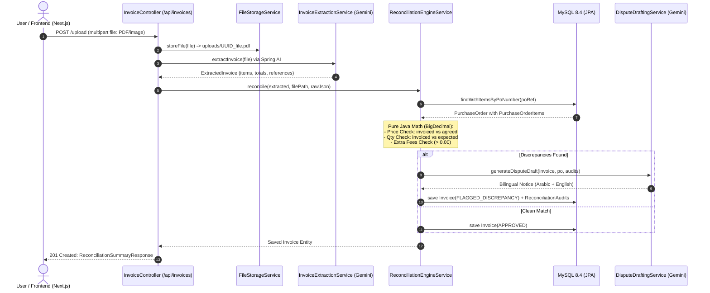

# Walkthrough: Phase 3 - Deterministic Reconciliation Engine & REST APIs

## Overview
Phase 3 establishes the end-to-end reconciliation core and REST API controllers for the Automated Invoice Reconciliation Agent. It connects the multimodal document extraction layer to internal Purchase Orders in MySQL 8.4, enforces 100% deterministic mathematical verification in pure Java, drafts formal bilingual (Arabic & English) dispute notices via Google Gemini (`gemini-3.8-flash`), and exposes complete RESTful endpoints for document upload, audit inspection, binary PDF preview streaming, and manual approval.

---

## Architecture & Data Flow



---

## Changes Implemented

### 1. New DTOs
- [InvoiceListItemResponse.java](file:///Users/mohamed.abdelfatah/Mohamed-Ramadan/Automated-Invoice-Reconciliation/src/main/java/com/agent/reconciliation/domain/dto/InvoiceListItemResponse.java):
  Summary DTO for dashboard list views returning `id, invoiceNumber, poReference, vendorName, invoicedTotal, reconciliationStatus, discrepancyCount, createdAt`.

### 2. Deterministic Java Reconciliation Engine
- [ReconciliationEngineService.java](file:///Users/mohamed.abdelfatah/Mohamed-Ramadan/Automated-Invoice-Reconciliation/src/main/java/com/agent/reconciliation/service/ReconciliationEngineService.java):
  - **Step A (PO Lookup):** Queries `purchaseOrderRepository.findWithItemsByPoNumber(poRef)`. If PO is missing, assigns `MANUAL_REVIEW`, logs `PO_NOT_FOUND` audit, and persists.
  - **Step B (Line Item Verification):** Matches invoiced items against approved PO lines by SKU code and bilingual semantic keyword matching.
    - *Price Mismatch:* `item.unitPrice().compareTo(poItem.agreedUnitPrice()) != 0` $\rightarrow$ creates audit with expected agreed price and billed actual price.
    - *Quantity Mismatch:* `item.quantity().compareTo(poItem.expectedQuantity()) != 0` $\rightarrow$ creates audit with ordered expected qty and billed actual qty.
    - *Unrecognized Item:* Flagged when an invoiced item does not exist in the PO.
  - **Step C (Extra Fees Check):** Any freight, delivery, or porterage surcharge (`extraFees > 0`) is flagged as `EXTRA_FEE`.
  - **Step D (Status Resolution):**
    - Zero audits $\rightarrow$ `APPROVED`.
    - 1+ audits $\rightarrow$ `FLAGGED_DISCREPANCY` and triggers dispute draft generation.

### 3. Bilingual Dispute Generator
- [DisputeDraftingService.java](file:///Users/mohamed.abdelfatah/Mohamed-Ramadan/Automated-Invoice-Reconciliation/src/main/java/com/agent/reconciliation/service/DisputeDraftingService.java):
  - Injects Spring AI `ChatClient.Builder` configured with Google Gemini (`gemini-3.8-flash`).
  - Generates formal, courteous commercial letters structured into:
    - **Section 1: Modern Standard Arabic** (`القسم الأول: إشعار الاعتراض المالي الرسمي`)
    - **Section 2: Professional Business English** (`Section 2: Formal Financial Dispute Notice`)
  - Includes offline fallback template ensuring 100% test and development reliability.

### 4. REST Controller
- [InvoiceController.java](file:///Users/mohamed.abdelfatah/Mohamed-Ramadan/Automated-Invoice-Reconciliation/src/main/java/com/agent/reconciliation/controller/InvoiceController.java) (`/api/invoices`):
  - `POST /upload`: Multipart upload $\rightarrow$ storage $\rightarrow$ extraction $\rightarrow$ deterministic audit $\rightarrow$ returns `201 Created` with `ReconciliationSummaryResponse`.
  - `GET`: Returns list of all processed invoices (`List<InvoiceListItemResponse>`).
  - `GET /{id}`: Returns complete invoice details with all itemized audits and dispute draft.
  - `GET /{id}/file`: Streams binary PDF/image content with inline `Content-Disposition` for browser previews.
  - `POST /{id}/approve`: Overrides status to `APPROVED` for payment authorization.

---

## Verification & Testing Results

### 1. Automated Test Suite (`./mvnw test`)
```
[INFO] Results:
[INFO] Tests run: 17, Failures: 0, Errors: 0, Skipped: 0
[INFO] BUILD SUCCESS
```

| Test Class | Test Count | Status | Description |
| :--- | :--- | :--- | :--- |
| `InvoiceExtractionServiceTest` | 3 | PASSED | Arabic receipt extraction, markdown parsing, empty file validation |
| `FileStorageServiceTest` | 4 | PASSED | File storage, resource retrieval, path traversal protection |
| `ReconciliationEngineServiceTest` | 4 | PASSED | Clean match approval, price/qty/extra fee audits, unrecognized items, PO missing |
| `InvoiceControllerTest` | 5 | PASSED | MockMvc testing of upload, list, detail, file stream, and approve endpoints |
| `ApplicationTests` | 1 | PASSED | Full Spring Boot context bootstrap with live MySQL connection |

---

### 2. Live Verification with `curl` & MySQL Container

#### A. Ingested Sample Invoice with Price Mismatch
Uploaded `sample_invoice_mismatch.pdf` (`PO-2026-001`, Tomatoes invoiced at 25.00 EGP vs agreed 20.00 EGP, plus 150.00 EGP delivery fee):
```bash
curl -X POST http://localhost:8080/api/invoices/upload -F "file=@sample_invoice_mismatch.pdf"
```

**Response Payload:**
```json
{
  "invoiceId": 1,
  "invoiceNumber": "INV-3860",
  "poReference": "PO-2026-001",
  "vendorName": "Al-Wadi Farms (مزارع الوادي)",
  "reconciliationStatus": "FLAGGED_DISCREPANCY",
  "invoicedTotal": 3400.00,
  "expectedTotal": 2750.00,
  "discrepancyCount": 2,
  "audits": [
    {
      "id": 1,
      "issueType": "PRICE_MISMATCH",
      "skuCode": "SKU-TOMATO-RED",
      "itemDescription": "طماطم بلدي طازجة فاخرة (Tomatoes)",
      "expectedValue": 20.00,
      "actualValue": 25.00,
      "explanation": "Price mismatch for SKU-TOMATO-RED: agreed unit price is 20.00 EGP, but invoiced at 25.00 EGP (variance: +5.00 EGP)"
    },
    {
      "id": 2,
      "issueType": "EXTRA_FEE",
      "skuCode": "SURCHARGE",
      "itemDescription": "Unapproved Surcharge / Delivery Fee (مشال / توصيل)",
      "expectedValue": 0.00,
      "actualValue": 150.00,
      "explanation": "Unapproved extra fee or freight surcharge of 150.00 EGP billed on invoice, not authorized in PO PO-2026-001"
    }
  ],
  "disputeDraft": "### القسم الأول: إشعار الاعتراض المالي الرسمي (اللغة العربية)...",
  "fileDownloadUri": "/api/invoices/1/file"
}
```

#### B. MySQL 8.4 Database Confirmation
```bash
docker exec reconciliation_mysql mysql -uroot -proot reconciliation_db -e "SELECT id, invoice_number, po_reference, invoiced_total, reconciliation_status FROM invoices; SELECT id, invoice_id, issue_type, expected_value, actual_value FROM reconciliation_audits;"
```

```
+----+----------------+--------------+----------------+---------------------+
| id | invoice_number | po_reference | invoiced_total | reconciliation_status |
+----+----------------+--------------+----------------+---------------------+
|  1 | INV-3860       | PO-2026-001  | 3400.00        | FLAGGED_DISCREPANCY |
+----+----------------+--------------+----------------+---------------------+

+----+------------+----------------+----------------+--------------+
| id | invoice_id | issue_type     | expected_value | actual_value |
+----+------------+----------------+----------------+--------------+
|  1 |          1 | PRICE_MISMATCH |          20.00 |        25.00 |
|  2 |          1 | EXTRA_FEE      |           0.00 |       150.00 |
+----+------------+----------------+----------------+--------------+
```

#### C. Payment Approval Verification
```bash
curl -X POST http://localhost:8080/api/invoices/1/approve
# Verified invoice status updated to APPROVED in both REST response and MySQL database.
```
